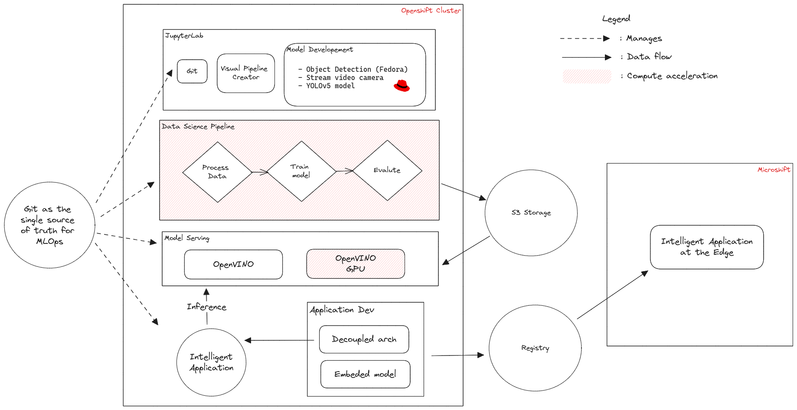

# MLOps and compute acceleration with Openshift AI

Leverage Openshift AI (RHOAI) to create and deploy anywhere a fedora detection model. This demo has been recorded during a Red Hat EMEA Open Demo and is [available here](https://www.youtube.com/watch?v=jAzWuNJRYGA).

## Table of contents

1. [Highlights](#highlights)
2. [Architecture](#architecture)
3. [Deployment](#deployment)
4. [Sources](#sources)

## Highlights

- Provision a JupyterLab environement
- Train a fedora detection model using YOLOv5
- Create a data science pipeline
- Serve and consume the model
- Accelerate compute and inference using a shared GPU
- MLOps using git as a single source of truth to trigger training and deploy the right model version in production
- Deploy at the edge using a Raspberry Pi and Microshift

## Architecture



## Deployment

Three clusters are used for this demo:

- A OpenShift Container Platform cluster with a node containing a Nvidia GPU
- A Single Node Openshift (SNO) with an ARM architecture to build container images with the embeded model
- Microshift for the edge container orchestration platform

### The Openshift cluster

#### Prerequisites

- An OpenShift Container Platform cluster 4.12 or greater
- (Optionnal) A node with a GPU is available. A [machineset example](./cluster/config/machineset.yaml) is available if your cluster if running on AWS. You can run this demo without it.

#### Customization

Adapt [this pipeline manifest](./cluster/instances/pipelines/training/pipeline.yaml) to fit your environement. Search for keyword `CHANGME`
Adapt [the git webhooks](./cluster/instances/gitea/custom/scripts.yaml) so that the container build on your arm cluster is automatically trigger on the pull request approval. Search for keyword `CHANGME`. You will need the domain of the SNO cluster but you can change it later.

#### Run

##### GPU

Wait for succeded installation between each of these commands:

```
oc apply -k ./cluster/operators
# Wait for operators installation
oc apply -k ./cluster/operators-instances
# Wait for operators instances installation
oc kustomize ./cluster/instances/ --enable-helm | oc apply -f -
# Wait for instances
```

Check [this document](./tests/gpu.md) to test the GPU integration

##### CPU only

Wait for succeded installation between each of these commands:

```
oc apply -k ./cluster/operators/base
# Wait for operators installation
oc apply -k ./cluster/operators-instances/base
# Wait for operators instances installation
oc kustomize ./cluster/instances/ --enable-helm | oc apply -f -
# Wait for instances
```

### The Single Node Openshift (SNO)

#### Prerequisites

- An OpenShift Container Platform cluster 4.13 or greater
- Openshift Pipelines operator is installed

#### Customization

Adapt [this pipeline manifest](./sno/pipeline/pipeline.yaml) to fit your environement. Search for keyword `CHANGME`

#### Run

```
oc apply -k ./sno/operators
# Wait for the operators to complete installation
oc apply -k ./sno/instances
```

### At the edge with Microshift on Rapsberry Pi

We will assume that the edge device is connected to internet and is able to pull from a specific contianer registry. In a disconnected / offline envirnoment you may want to embed your application within the OS. Deployment options are described [in the documentation](https://access.redhat.com/documentation/en-us/red_hat_build_of_microshift/4.14/html/running_applications/index).

1. OS installation: Fedora IoT is used as the OS. An installation guide is [available here](https://www.redhat.com/sysadmin/fedora-iot-raspberry-pi).  
2. Microshift deployment: [This guide](https://medium.com/@ben.swinney_ce/openshift-raspberry-pi-2e78f2990395) can be used to deploy microshift once the OS is properly installed.
3. Application deployment: Deploy the application that streams a wired camera and that has the model embeded. Adapt [this manifest](./edge/app.yaml) replacing the deployment image with the one created from your SNO cluster. Search for keyword `CHANGME`. Use the default Kubernetes mechanism such as pull policies to trigger the deployment of the new versions.

## Sources


| Location                                | Description                                                                                 | Pull address                                    |
|-----------------------------------------|---------------------------------------------------------------------------------------------|-------------------------------------------------|
| [browser-fedora-detection](./applications/browser-fedora-detection) | Frontend that streams your webcam and does inference using GRPC protocol                    | quay.io/alegros/browser-fedora-detection:v1     |
| [edge-detection](./applications/edge-detection)         | Flask app that connects to a device camera with the model embeded to predit streams locally | quay.io/alegros/remote-camera-detection:aarch64 |