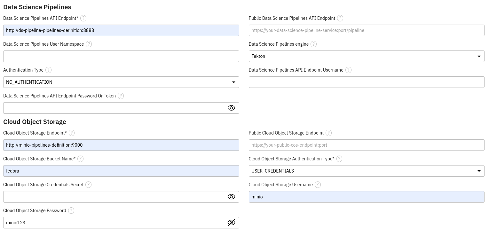

# Create the jupyterlab environement

You have to provision manually the jupyterlab environment.

Go to RHOAI console and create a workbench:
- Select the Standard Data Science notebook image.
- Choose at least 20Gb storage if you train the model inside the notebook
- Bind the existing `s3-creds` data connection

In the jupyterlab environement add a new runtime as follow:

In the jupyterlab environement clone the git repo previously deploy using the endpoint: `http://gitea-http.ci-cd.svc.cluster.local:3000/data-scientist-1/fedora-detection`

Use those credentials to push your code to git:
- **USERNAME**: data-scientist-1  
- **PASSWORD**: rhods
